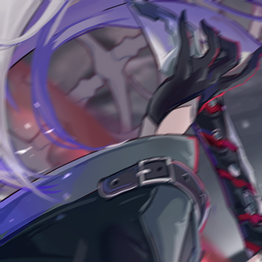

```json
{
    "type": "blur",
    "filter": ["box", "gauss", "median","lens","motion"],
    "kernel": [0, 1],
    "target_kernel": {
      "box": [0,2],
      "gauss": [0,2],
      "median": [0,1],
      "lens":[1,2]
    },

    "motion_size": [0,10],
    "motion_angle": [-30,30],

    "probability": 0.5
    }
```

`*` = optional parameters

standard:
- `filter` - The list of blue algorithms to use. One is randomly picked per image
- `kernel`* - A range of blur levels for each algorithm. `[low,high]`.
   - All but median blur support float numbers.
   - This only applies if `target_kernel` is not set
- `target_kernel`* - Separate kernel range for each blur filter
- `probability`* - The chance of applying (e.g. 0.5 = 50% chance of being applied)


motion:
- `motion_size`* - The motion blur size. Uses `[uint, uint]`
- `motion_angle`* - Degree of rotation for motion blur. Uses `[int, int]`
## Examples:


  <div> Raw</div>
  
  <div> Box kernel: 2</div>
  
  <div> Gauss kernel: 2</div>
  
  <div> Lens kernel: 2</div>
  
  <div> Median kernel: 3</div>
  
  <div> Motion size: 10, angle 30</div>
  

