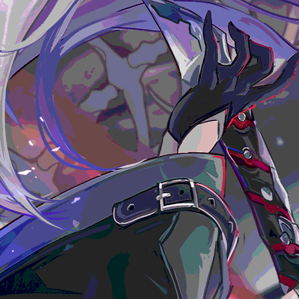

```json
{
  "type": "dithering",
  "type_dither": ["floyd", "bayer"],
  "bits": [1,4],
  "probability": 0.5
}
```

### Parameters
- `type_dither`* - Controls the dithering algorithm
  - Default: ["floyd"]
  - Options:
    - "floyd": Floyd-Steinberg dithering
      - Creates a diffused, natural-looking pattern
      - Better for photographic images
    - "bayer": Ordered dithering
      - Creates a regular, grid-like pattern
      - Better for graphics and text

- `bits`* - Controls color depth reduction
  - Format: [min, max]
  - Default: [1, 1]
  - Range: 1-8
  - Example: [1,4] means:
    - 1 bit = Black & White only (2 colors)
    - 2 bits = 4 colors
    - 3 bits = 8 colors
    - 4 bits = 16 colors
  - Lower values create more obvious dithering

- `probability`* - Chance of applying effect
  - Default: 1.0
  - Range: 0.0 to 1.0

## Examples:
all color_ch = 8
<div> Raw</div>

<div> Quantize</div>

<div> SierraLite</div>

<div> Jarvisjudiceninke</div>

<div> sierra</div>

<div> Stucki</div>

<div> Tworowsierra</div>

<div> Atkinson</div>

<div> Floydsteinberg</div>

<div> Burkes</div>

<div> Order map_size: 8</div>

<div> Riemersma history: 10 ratio: 0.5</div>

