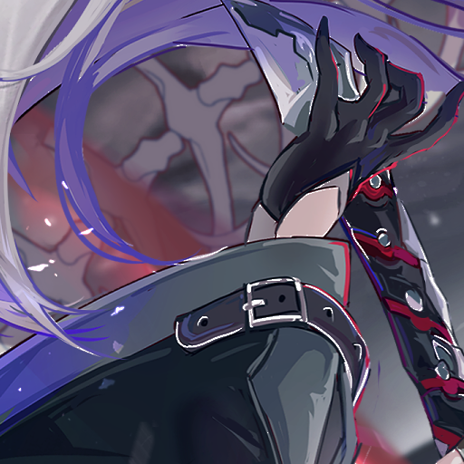
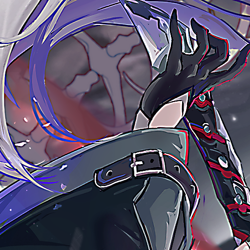

```json
{
      "type": "halo",
      "type_halo": [ "unsharp_mask", "unsharp_halo"],
      "kernel": [0,3],
      "amount": [0,1],
      "threshold": [0,20]
}    
```
`*` = optional parameters

- `type_halo` - The list of halo algorithms to use. One is randomly picked per image
- `kernel` - This applies median blur with a random kernel `list[float|int]` (necessary to reduce artifacts)
- `amount` - Strength of the halo
  - `unsharp_mask`:
    - `threshold` - Controls the halo threshold. Accepts a `list[float|int]`, with a range of 0-1. Note that these are not pixel values but percentages. (i.e., 0.5 ~= 50% threshold.)
- `probability`* - The chance of applying (e.g. 0.5 = 50% chance of being applied)

Note: It's better to apply this before blurring. It takes only the white halo and it comes out at 1 bit
## Examples:
all kernel = 3 amount = 4
<div> Raw</div>

<div> Unsharp_halo</div>

<div> Unsharp_mask threshold: 10</div>
