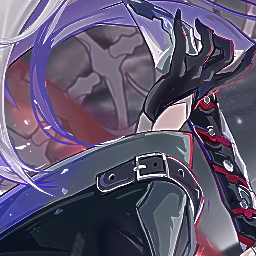

```hcl
degradation {
  type = "halo"
  type_halo = ["unsharp_mask","unsharp_halo","unsharp_gray"]
  kernel = [0,3]
  amount = [0,1]
  threshold = [0,0.5]
  probability = 0.5
}
```
### Parameters
- `type_halo`* - Controls how halos are generated
  - Default: ["unsharp_mask"]
  - Uses unsharp masking to create light/dark edges around objects
  - Creates the "glow" or "halo" effect often seen in over-processed images
  - Simulates over-sharpening artifacts

- `kernel`* - Controls the width of the halo effect
  - Format: [min, max]
  - Default: [0, 2]
  - Larger values create wider, more noticeable halos
  - Smaller values create thin, subtle edges

- `amount`* - Controls the intensity of the halo
  - Format: [min, max]
  - Default: [1, 1]
  - Higher values create stronger contrast at edges
  - Values > 2 create very obvious halos

- `threshold`* - Controls which edges get halos
  - Format: [min, max]
  - Default: [0, 0]
  - Range: 0.0-1.0
  - Only applies halos where pixel difference > threshold
  - Higher values only affect high-contrast edges

- `probability`* - Chance of applying effect
  - Default: 1.0
  - Range: 0.0 to 1.0

## Examples:
all kernel = 3 amount = 4
<div> Raw</div>

<div> Unsharp_halo</div>

<div> Unsharp_gray</div>

<div> Unsharp_mask threshold: 10</div>

