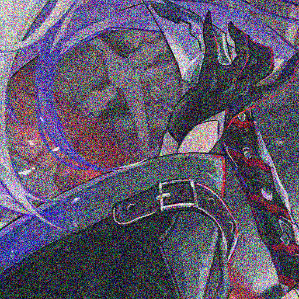
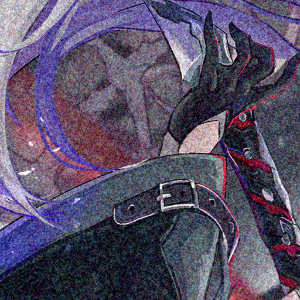
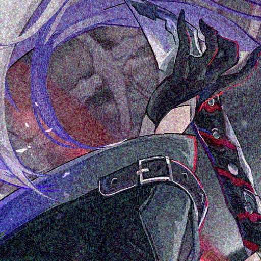
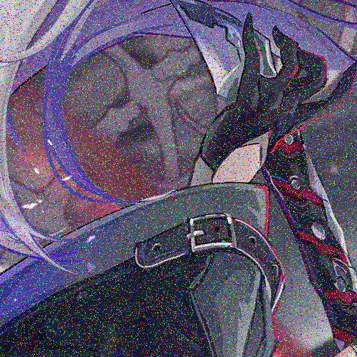
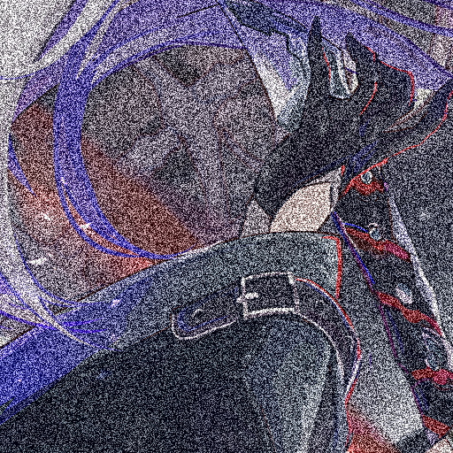
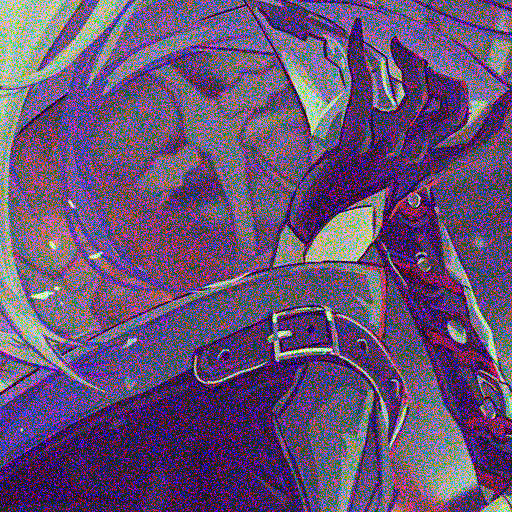

```json
{
  "type": "noise",
  "type_noise": ["perlinsuflet", "perlin", "opensimplex", "simplex", "supersimplex", "uniform", "salt", "salt_and_pepper", "pepper", "gauss"],

  "normalize": true,
  "y_noise": 0.3,
  "uv_noise": 0.3,
  "alpha": [0.01,0.5,0.01],
  "scale": [1, 2],
  
  "octaves": [1,10,1],
  "frequency": [0.1,0.9,0.1],
  "lacunarity": [0.01,0.5,0.01],
  "probability_salt_or_pepper": [0,0.02],

  "bias": [-0.5, 0.5],
  "probability": 0.5
}
```
`*` = optional parameters


- `type` - The list of blur algorithms to use. One is randomly picked per image
- `alpha`* - Controls how transparent the noise is when overlaid
- `probability`* - The chance of applying (e.g. 0.5 = 50% chance of being applied)
- `y_noise`* - Generates color noise. 0 = enabled, 1 = disabled
  - The chance that the noise will be applied only on the tone component in color images.
- `uv_noise`* - Generates monochrome noise. 0 = enabled, 1 = disabled
  - The chance **that noise will only affect color components, ignoring tone in color images**
- `bias` - The noise offset. Uses `[int,int]` with min -1, max 1
- `scale` - Noise resize increases noise, works only with uniform and gauss.

Additional settings for this noise list ("perlinsuflet", "perlin", "opensimplex", "simplex", "supersimplex")
- `normalize`* - Normalizes noise within the range of `-1 - 1` (bool)
  - 👋 opensimplex
- `octaves`* - Noise re-call amount. Accepts `[low, high, step]`
- `frequency`* - Division of image point size. Accepts `[low, high, step]`
  - Image point size refers to the size of the smallest discernible element (pixel) in an image
- `lacunarity`* - Controls how much the frequency decreases when the frequency is multiplied by the lacunarity. Accepts `[low, high, step]`.

Additional settings for this noise list ("salt","pepper","salt_and_pepper")
- `probability_salt_or_pepper`* - The percentage of salt and pepper noise applied
## Examples 1:
### all alpha: 0.5
<div> raw</div>

<div> uniform</div>

<div> gauss</div>


### all octaves: 10 frequency: 0.5 lacunarity: 0.5
<div> perlinsuflet</div>

<div> opensimplex</div>

<div> perlin</div>

<div> simplex</div>

<div> supersimplex</div>


### all probability_salt_or_pepper: 0.05
<div> salt</div>

<div> pepper</div>

<div> salt_and_pepper</div>


## Examples 2:
### all alpha = 0.5
<div> uniform y_noise = 1.0</div>

<div> uniform uv_noise = 1.0</div>



