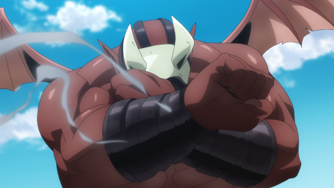

```json
  {
    "type": "resize",
    "alg_lq": ["box", "hamming", "linear", "lagrange", "cubic_catrom", "cubic_mitchell", "cubic_bspline", "lanczos", "gauss", "down_up", "down_down"],
    "alg_hq": ["lagrange"],
    "down_up": {
      "up": [1, 2],
      "alg_up": ["nearest", "box", "hamming", "linear", "lagrange", "cubic_catrom", "cubic_mitchell", "cubic_bspline", "lanczos", "gauss"],
      "alg_down": [ "hamming", "linear", "lagrange", "cubic_catrom", "cubic_mitchell", "cubic_bspline", "lanczos", "gauss", "down_down"]
    },

    "down_down": {
      "step": [1, 6],
      "alg_down": [ "linear", "lagrange", "cubic_catrom", "cubic_mitchell", "cubic_bspline"]
    },

    "spread": [1, 2, 0.05],
    "scale": 4,
    "color_fix": true,
      "gamma_correction": false,
      "probability": 0.5
  }
```
`*` = optional parameters

- `alg_lq` and `alg_hq` - The list of blur algorithms to use. One is randomly picked per image
- `down_up` - This algorithm increases the resolution of the image through resizing, then downsizes it again.
  - `up` - The range for randomly selecting the image enlargement amount.
  - `alg_up` - The filter to use for downsizing (cannot contain down_down or down_up)
  - `alg_down` - The filter to use for downsizing (cannot contain down_up)
- `down_down` - This algorithm downsizes an image through resizing, then downsizes it again.
  - `step` - How many steps the image size can be reduced by.
  - `alg_down` - The filter to use for downsizing (cannot contain down_down or down_up)

- `spread`* - The range for randomized scatter reduction.
  - e.g. if HQ = 512 and LQ = 256, setting this parameter with a range of [1 ,2, 0.25] will result in HQ = 512-256 and LQ = 256-128.
- `color_fix`* - At 5 points the image crashes, this is necessary since some chainner_ext interpolations can add a grid on white within a radius of up to -5 from the maximum
- `gamma_correction`* - Enable or disable gamma correction in chainner_ext
- `probability`* - The chance of applying (e.g. 0.5 = 50% chance of being applied)

## Examples:
<div> Raw</div>

<div> Box scale = 4</div>
