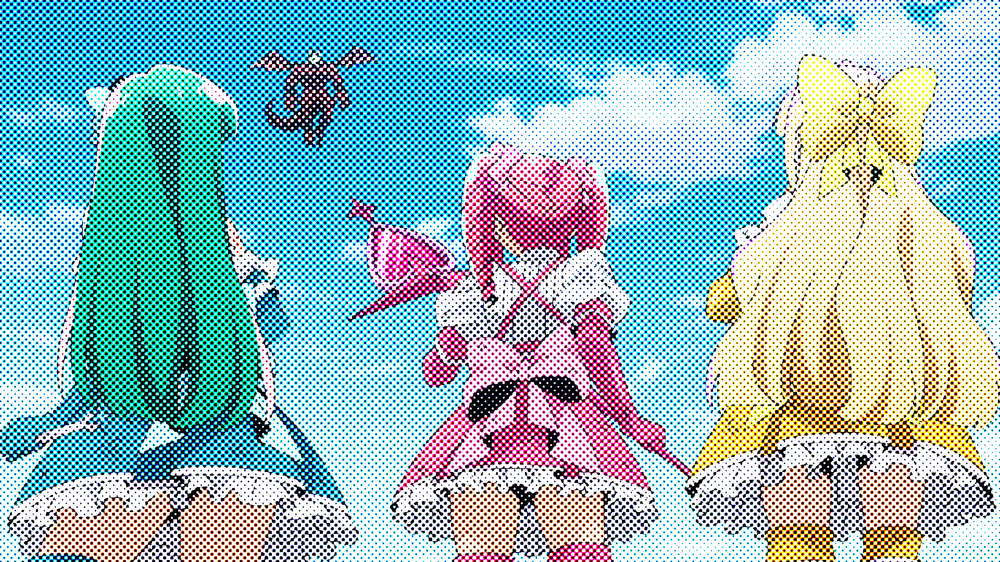
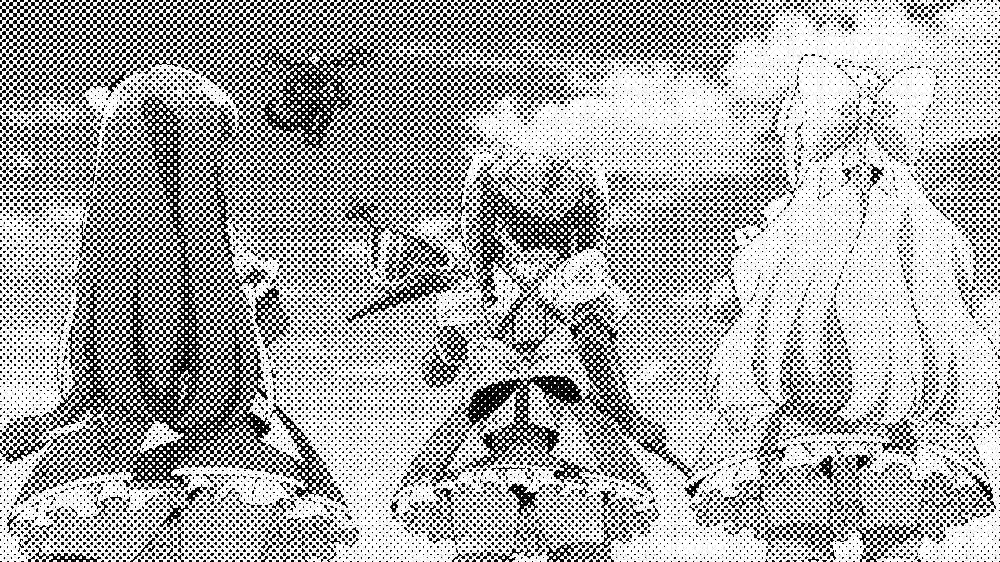
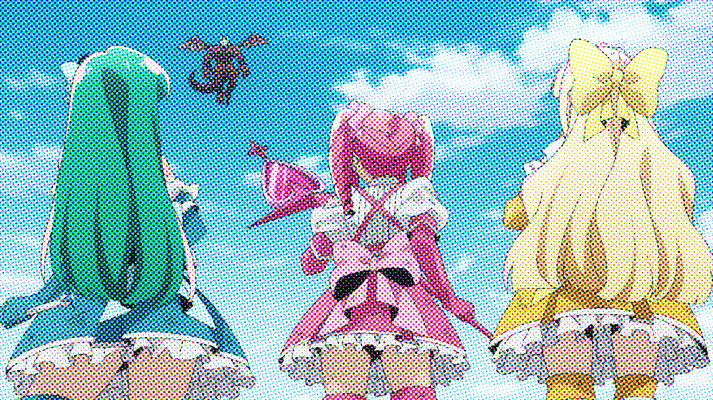
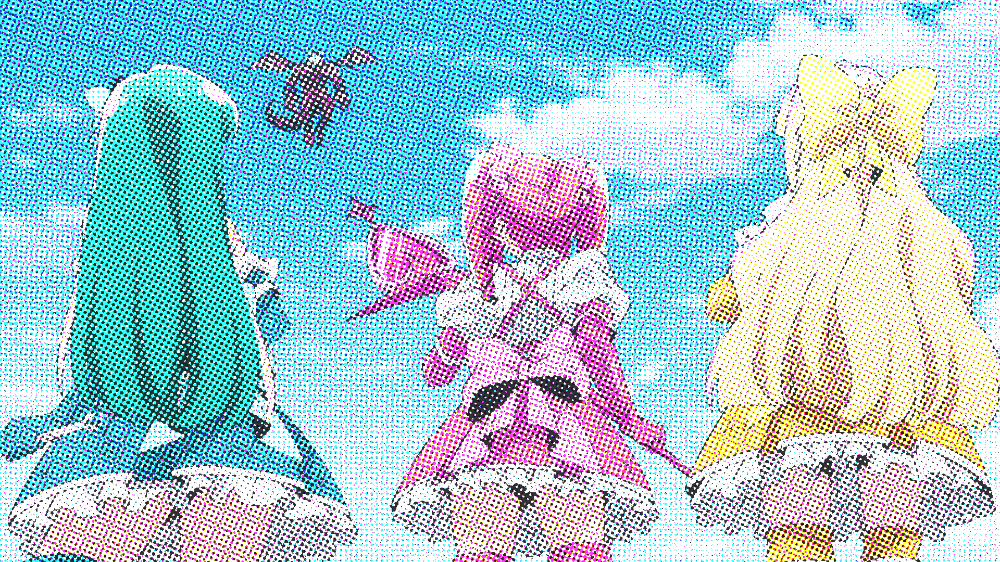

```json
  {
    "type": "screentone",
    "lqhq": false,
    "dot_size": [7],
    "color": {
      "type_halftone": ["rgb","cmyk","gray","not_rot","hsv"],
      "c": [-45,45],
      "m": [-45,45],
      "y": [-45,45],
      "k": [-45,45],

      "r": [-45,45],
      "g": [-45,45],
      "b": [-45,45],
      "cmyk_alpha": [0.5,1.0],
      "1_ch_dot_type": ["circle"],
      "2_ch_dot_type": ["circle"],
      "3_ch_dot_type": ["circle"],
      "4_ch_dot_type": ["circle"]
    },
    "dot_type": ["line", "cross", "circle", "ellipse"],
    "angle": [0,0],
    "probability": 0.5
  }
```
`*` = optional parameters

- `color`* - These setting apply if the image is RGB or otherwise 3 dimensional
  - `type_halftone`* - The list of halftone algorithms from which a random halftone algorithm is chosen
  - `c..k` and `r..b`* - Takes in a value from the `[low, high]` format. A random number will be selected in this range to be used for channel rotation.
  - `cmyk_alpha`* - This controls the transparency of applied cmyk halftones. This is necessary to get closer to real comics list. Accepts `[uint, uint]`
  - `{n}_ch_dot_type`*
- `dot_size` - Controls the size of generated points. Accepts a range
- `dot_type`*
- `angle`*
- `lqhq`* - Equates hq to lq, assuming the screentone is first in line
- `probability`* - The chance of applying (e.g. 0.5 = 50% chance of being applied)
## Examples:
### all dot_size = 7
<div> raw</div>

<div> not_rot</div>

<div> gray</div>

<div> rgb r = -30 g = 0 b = 30 </div>

<div> cmyk c = -45 m = 30 y = 15 k = 15</div>

<div> cmyk_alpha 0.8</div>


