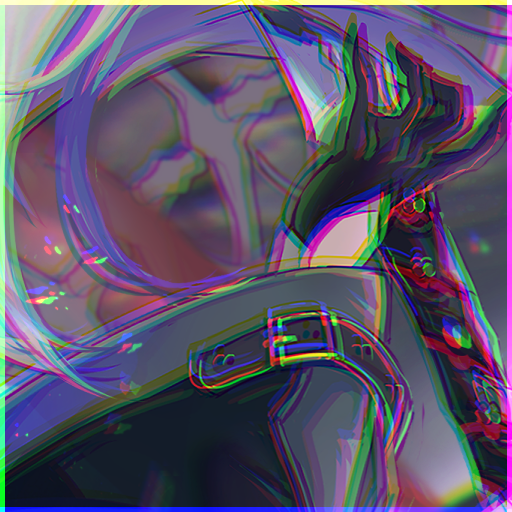
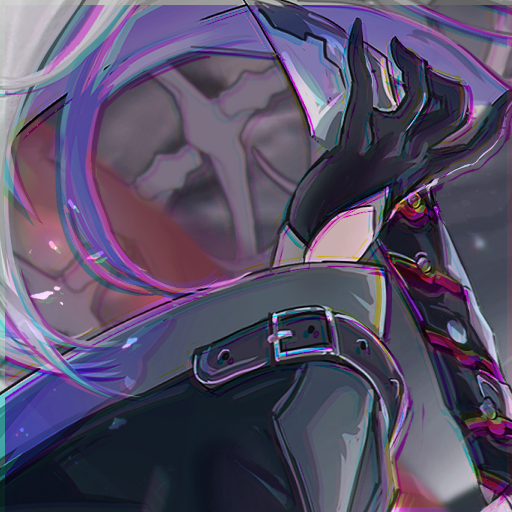
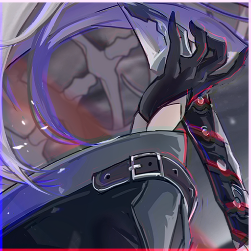

```json
  {
    "type": "shift",
    "shift_type": ["rgb", "yuv", "cmyk"],
    "percent": true,
    "rgb": {
      "r": [[-10,10],[-10,10]],
      "g": [[-10,10],[-10,10]],
      "b": [[-10,10],[-10,10]]
    },
    "cmyk": {
      "c": [[-10,10],[-10,10]],
      "m": [[-10,10],[-10,10]],
      "y": [[-10,10],[-10,10]],
      "k": [[0,0],[0,0]]
    },
    "yuv": {
      "y": [[-10,10],[-10,10]],
      "u": [[-10,10],[-10,10]],
      "v": [[-10,10],[-10,10]]
    },
    "not_target":[[-10,10],[-10,10]],
    "probability": 0.5
  }
```
`*` = optional parameters

- `shift_type`* - The list of offset type to use. One is randomly picked per image.
  - In fact the type is the space in which channel offsets occur
- `percent`* - If true, the offset values = the offset percentage. If false, the offset values are in pixels
- `(rgb,cmyk,yuv)`* - Ranges from which the offset is set for each color channel. Each channel is a range: `[[int, int],[int, int]]`
   - The first range controls the x offset
   - The second controls the y offset
- `not_target`* - Values that will be used if there are no valid values in the channel
- `probability`* - The chance of applying (e.g. 0.5 = 50% chance of being applied)
## Examples:
### all percent = true
<div> raw</div>

<div> rgb r = [[-1], [1]] g = [[1], [1]] b = [[-1], [-1]]</div>

<div> cmyk c = [[-1], [1]] m = [[1], [1]] y = [[-1], [-1]] k = [[0], [0]]</div>

<div> yuv y = [[-1], [1]] u = [[1], [1]] v = [[-1], [-1]]</div>

